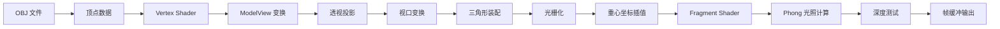

# My Tiny Renderer

基于 [tinyrenderer](https://github.com/ssloy/tinyrenderer) 教程实现的软光栅化渲染器，使用纯 C++ 从零构建 OpenGL 风格的渲染管线。

> 详细学习笔记：[tinyrenderer 学习](https://eurekablog.pages.dev/posts/tinyrenderer/tinyrenderer%E5%AD%A6%E4%B9%A0/)

## ✨ 功能特性

- **手动实现的数学库** (`geometry.h`)：向量 (vec2/3/4)、矩阵、点积、叉积、矩阵求逆、转置等
- **TGA 图像处理** (`tgaimage.h/cpp`)：支持 RGB/RGBA/Grayscale 格式的 TGA 文件读写，含 RLE 压缩/解压
- **OBJ 模型加载** (`model.h/cpp`)：解析 OBJ 格式的几何数据，自动关联漫反射纹理、法线贴图和高光贴图
- **类 OpenGL 渲染管线** (`our_gl.h/cpp`)：
  - ModelView 矩阵（lookat 相机变换）
  - 透视投影矩阵
  - 视口变换矩阵
  - 深度测试（Z-buffer）
  - 三角形光栅化（重心坐标插值，透视校正）
  - 背面剔除
- **Phong 光照模型**：环境光 + 漫反射 + 镜面高光
- **法线贴图 (Normal Mapping)**：切线空间法线扰动，增强表面细节
- **阴影贴图 (Shadow Mapping)**：双通道渲染，生成硬阴影

## 🔧 编译与运行

### 依赖

- C++17 编译器（GCC / Clang / MSVC）
- OpenMP（用于并行光栅化，可选）

### 编译

```bash
# 使用 g++ 编译（macOS / Linux）
g++ -std=c++17 -O2 -fopenmp -o main main.cpp tgaimage.cpp model.cpp our_gl.cpp

# 或使用 clang++（需安装 libomp）
clang++ -std=c++17 -O2 -Xpreprocessor -fopenmp -lomp -o main main.cpp tgaimage.cpp model.cpp our_gl.cpp
```

### 运行

```bash
./main obj/diablo3_pose/diablo3_pose.obj
# 或同时渲染多个模型
./main obj/diablo3_pose/diablo3_pose.obj obj/floor.obj
```

### 输出文件

| 文件 | 说明 |
|------|------|
| `framebuffer.tga` | 最终渲染结果 |
| `shadowmap.tga` | 阴影贴图（光源视角） |
| `zbuffer1.tga` | 相机深度缓冲区可视化 |
| `zbuffer2.tga` | 光源深度缓冲区可视化 |

## 📁 项目结构

```
my_tinyrenderer/
├── main.cpp              # 主程序：着色器定义 + 双通道渲染流程
├── geometry.h            # 数学库：向量/矩阵模板、几何运算
├── tgaimage.h/cpp        # TGA 图像格式读写（含 RLE 压缩）
├── model.h/cpp           # OBJ 模型加载器，纹理自动关联
├── our_gl.h/cpp          # 渲染管线核心：变换矩阵、光栅化、深度测试
├── readme.md
└── obj/                  # 示例模型
    ├── african_head/     # 非洲人头像（Vidar Rapp, CC 许可）
    ├── boggie/           # Boggie 角色模型（身体+头部+眼睛）
    ├── diablo3_pose/     # 暗黑破坏神3 角色模型
    └── floor.obj         # 地板平面
```

## 🎨 渲染管线流程



## 📝 核心实现要点

### 1. 坐标空间变换

```
模型空间 → ModelView矩阵 → 眼睛空间 → Perspective矩阵 → 裁剪空间
→ 透视除法 → NDC → Viewport矩阵 → 屏幕空间
```

### 2. 光栅化与重心坐标

- 在屏幕空间中计算像素的重心坐标 `bc_screen`
- 透视校正：`bc_clip = bc_screen / w` 然后归一化
- 使用校正后的重心坐标在 Fragment Shader 中插值属性

### 3. Phong 着色器

```
color = ambient * base + diffuse * max(0, N·L) * base + specular * max(0, R·V)^n
```

支持法线贴图，在切线空间中采样法线方向，转换到世界空间进行光照计算。

### 4. 阴影贴图

1. **第一通道**：从光源视角渲染场景，将深度写入 `zbuffer`
2. **阴影测试**：将每个像素从相机空间反投影到光源 NDC，比较深度值判断是否被遮挡

## 📖 参考资料

- [tinyrenderer 原教程](https://github.com/ssloy/tinyrenderer) — Dmitry Sokolov
- [tinyrenderer 学习笔记](https://eurekablog.pages.dev/posts/tinyrenderer/tinyrenderer%E5%AD%A6%E4%B9%A0/) — 本项目作者
- [TGA 文件格式规范](https://www.gamers.org/dEngine/quake3/TGA.txt)

## 📄 许可

本项目为学习目的编写，示例模型版权归各自原作者所有：

- African Head: © Vidar Rapp
- Diablo 3 Pose: © Blizzard Entertainment
- Boggie: 来自 tinyrenderer 原项目
